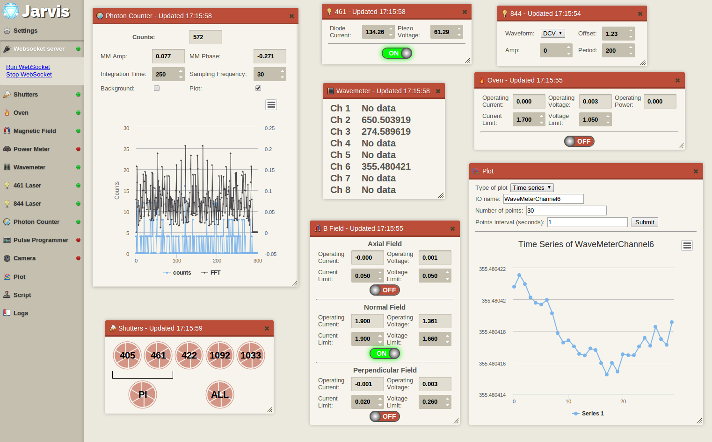

JARVIS 1.0
==========

July-September 2014, Helena Zhang

Your friendly neighborhood all-powerful data acquisition and monitoring suite.

INSTALLATION
------------

Clone the repository, as well as the DeviceWorkers and MTServer repositories. Link `www/prog/` to the `prog/` directory under in DeviceWorkers. Point your web server to `Jarvis/www`. Start `websocketserver.py` under `websocketserver/`.

FILES
--------------

`websocketserver/websocketserver.py`: universal server that facilitates device-to-web 
communication. Only one instance of websocketserver needs to be run. 
It connects to all the instances of MTserver, of which there is one instance
 per device. Large threads are contained in separate files in the same directory. See the header of `websocketserver.py` for more info.

`websocketserver/devices_dict`: dictionary file containing MTserver names, addresses, and port.  Used for websocketserver.py to connect to the MTservers.

`methods_dict`: contains all device names as well as their IOs

`www/` contains Jarvis web client files:
- `index.html` is the skeleton which loads all other files
- each IO module has its own `ioname.html` file, which contains the HTML elements as well as the javascript which updates it
- `ws.js` contains the websocket communication functions and talks to websocketserver
    
`blog_screenshot` is a shell script that takes the screenshot of the top monitor (has Jarvis on rabi) and blogs it.    

Libraries used:
- **jQuery UI 1.9.0** for GUI elements, theme from http://medialoot.com/preview/frame/jquery-ui-retro.html
- **Highcharts** for plotting
- **jQuery.cookie** from https://github.com/carhartl/jquery-cookie for saving Jarvis appearance between browser sessions

WIDGETS
-------

- Trap electrodes
- Pulse programmer
- Photon counter
- Laser controller (Pichu)
- Newport controller
- Wavemeter
- Power meter
- Shutters
- Oven
- B field
- Camera (Andor)
- Oscilloscope (Tektronix)
- Function generator (Agilent)
- Locking
- Scripts
- Logs

MAKING ADDITIONS
----------------

Make sure your new IDs and classes are unique names. Please follow the naming conventions: capitalized for IDs and lowercase for classes.

TODO
----

##### Urgent #####
- change auto readout of ddscon to comm variable so multiple clients don't cause unnecessary updates
- plotting QuAD outputs
- electrodes indicate when done shuttling
- menu with icons
- fix PMT flot
- allow text highlighting
- widget for server status
- fix time plot: lots of extra data points being taken and plots get stuck
- make plotting several series in scripts easier
- graphing and locks: allow multiple
- graphing and scripts: save settings as new presets
- graphing: comments in file headers 
- graphing: plot two things on Y-axis: right now only works for IOs in same device

##### GUI #####
- fix ugly extra space on top of some widgets
- resize workspace when window resized
- tooltip too far to right, stuck on 
- button to shrink menu
- add cover on some settings so they won't get accidentally set

##### Quick and easy #####
- MTserver turn on/off debugging on prompt

##### Camera #####
- warn when overexposed with EM gain on
- fix memory leak
- save region of interest
- counts and max for each individual ROI
- isolated crop mode
- kinetic mode
- better rescaling
- subtract background

##### Pulse programmer #####
- change IOs to laser names

##### Scripts #####
- show runtime
- show up in all clients
- progress indicated by tab color
- don't allow script to run when devices not on
- script header to denote plot title
- output to Jarvis

##### Photon counter #####
- sometimes doesn't update for a while?

##### Graphing #####
- plots should show up in all clients
- add scanning in loop option
- plot two things on X-axis (ex. DAC and wavemeter frequency)
- heatmap graph direction choices
- heatmap makes things slow
- random test data option
- export doesn't work sometimes
- exporting multiple colors becomes all blue
- multiple plots
- plot from file

##### Miscellaneous #####
- add logging to database options to log widget
- restore blog button functionality
- use dictionaries to send long commands rather than strings
- screenshots should be of the Jarvis window that called it, not always quanta-rabi
- autoconnect to websocketserver option
- autostart MTservers script
- Make textboxes larger
- Jarvis appears to be an unresponsive tab in Chrome sometimes (only if camera is on?)
- MTserver sleep should take into account UPDATE run time (seems like it should already?)
- check status of and stop/start MTservers from Jarvis
- snapshot feature: save all current variables to file
- replace timestamps with rabi time
- spin digits
- more documentation for websocketserver
- update intervals should be correct on start-up

NOTES
-----
- Websocket connecting to 127.0.0.1 instead of the actual quanta-rabi IP leads to a weird frame containing cookie data upon connecting. Now that quanta-rabi is on a static IP, this should no longer be an issue. 

SAMPLE OUTPUT FROM DEVICES
---------------------------

**Shutters**
>STATUS 1407784757.2 {1033: 'OPEN', 1092: 'OPEN', 405: 'CLOSE', 422: 'CLOSE', 461: 'CLOSE'}

**AgilentBO**
>STATUS 1407882699.2 {'BPerpCurrentOP': 0.0001600276, 'OvenVoltageOP': 0.000964118, 'BPerpCurrentLim': 1.5, 'OvenVoltageLim': 0.02, 'OvenCurrentOP': -0.0001239447, 'OvenState': False, 'BVertCurrentOP': -0.000688811, 'BVertCurrentLim': 0.08, 'BPerpState': False, 'BVertChannel': 3, 'BAxialCurrentLim': 1.9, 'BAxialState': True, 'BVertState': False, 'OvenCurrentLim': 0.08, 'BAxialVoltageLim': 2.0, 'BPerpChannel': 4, 'BAxialChannel': 2, 'BPerpVoltageLim': 2.0, 'BVertVoltageOP': 0.0005264693, 'BAxialVoltageOP': 1.297288, 'BVertVoltageLim': 0.04, 'BAxialCurrentOP': 1.899792, 'BPerpVoltageOP': -0.001186327, 'OvenChannel': 2}

**Newport**
>STATUS 1412097853.07 {'DiodeCurrent': '155.13', 'OutputState': '1', 'UsageTime': '1008.8', 'PiezoVoltage': '54.67'}

SAMPLE OUTPUT FROM WEBSOCKET SERVER
-----------------------------------

The websocket server changes the delimiter to semicolons, adds device name, and changes the dictionary to JSON format (double instead of single quotes for strings) so that Jarvis can easily parse it:

**Shutters**
>STATUS;1412272142.82;Shutters;{"1033": "CLOSE", "1092": "CLOSE", "405": "CLOSE", "422": "CLOSE", "461": "CLOSE"}

**PowerMeter**
>STATUS;1412264637.53;PowerMeter;{"PowerMeterWavelength": 405.0, "PowerMeterPower": 0.000708031119, "PowerMeterMinPower": 5.5e-08, "PowerMeterMaxPower": 0.0055}

**AgilentBO**
>STATUS;1410121187.83;AgilentBO;{"BNormState": true, "OvenCurrentLim": 0.02, "OvenVoltageOP": 0.002347491, "BPerpCurrentLim": 0.1, "OvenVoltageLim": 0.04, "OvenCurrentOP": 0.0001368476, "OvenState": false, "BPerpState": false, "BNormVoltageOP": 1.312676, "BNormChannel": 2, "BAxialCurrentLim": 0.08, "BAxialState": false, "BNormVoltageLim": 2.0, "BPerpCurrentOP": -0.00064739, "BAxialVoltageLim": 0.03, "BPerpChannel": 3, "BNormCurrentOP": 1.899935, "BNormCurrentLim": 1.9, "BAxialChannel": 1, "BPerpVoltageLim": 0.4, "BAxialVoltageOP": 0.00123857, "BAxialCurrentOP": -8.380872e-05, "BPerpVoltageOP": 0.002287482, "OvenChannel": 4}

**Wavemeter**
>STATUS;1412264679.69;WaveMeter;{"WaveMeterChannel1": 739.3965959609156, "WaveMeterChannel2": 650.5062966743386, "WaveMeterChannel3": 274.58577049325464, "WaveMeterChannel4": 647.4860834640874, "WaveMeterChannel5": -3.0, "WaveMeterChannel6": 355.48116242598053, "WaveMeterChannel7": -3.0, "WaveMeterChannel8": 0.0}

**PhotonCounter**
>STATUS;1412869819.71;PhotonCounter;{"Count": 728, "MMAmp": 0.029039275273680668, "IntTime": 250.0, "MMPhase": 0.2800784111022898, "DataState": false, "Background": true, "Data": 0, "SampFreq": 30.0}

**Data point for time series plot**
>PLOT1410120082.923;1410120085.38;PowerMeter;{"PowerMeterWavelength": 1092.0, "PowerMeterPower": 2.16008611e-05, "PowerMeterMinPower": 5.5e-08, "PowerMeterMaxPower": 0.0055}

**Data point for 2-D plot**
>PLOT2D1413417416.385-0;1413417607.37;{"Count": 253002, "MMAmp": 0.006945532513782382, "DAC3period": 200.0, "DAC2wave": "DCV", "DAC1period": 10000.0, "MMPhase": -0.5187031328678131, "DAC2period": 200.0, "DataState": false, "DAC1amp": 0.0, "SampFreq": 30.0, "DAC1offset": 0.9399999999999995, "DAC0amp": 0.0, "DAC2amp": 0.0, "DAC0period": 200.0, "DAC0wave": "DCV", "DAC3offset": 1.5, "DAC3wave": "DCV", "IntTime": 250.0, "DAC1wave": "DCV", "DAC3amp": 0.0, "DAC2offset": 0.0, "Background": true, "Data": 0, "DAC0offset": 0.0}

**Data point for heatmap plot**
>PLOTHEAT1413992777.767-0-0;1413992778.83;{"Count": 373741, "MMAmp": 0.008434215071611104, "IntTime": 250.0, "MMPhase": -0.22350106403231695, "DataState": false, "Background": true, "PARAM 1 2": 0.0, "PARAM 1 0": 0.0, "Data": 0, "SampFreq": 30.66}

SAMPLE JARVIS REQUESTS
----------------------

**Important:** If you are sending multiple commands in a row, append your command with newline so that MTserver can parse it correctly. Otherwise the commands will be stuck together (see trapelectrodes.html for an example).

**Open 405 shutter**
>SET;Shutters;OPEN 405

**Change power meter wavelength**
>SET;PowerMeter;WAVELENGTH 405

**Change 461 laser piezo voltage**
>SET;Newport;PiezoVoltage 60.5

**Start time series plot of power meter power with interval 0.05s and 50 points**
>PLOT;TIMESERIES;1409946594.606;PowerMeterPower;0.05;50

**Run helloworld Python script under www/scripts folder**
>SCRIPT;helloworld

**Lock 844 laser offset to wavemeter channel 6 centered around 355.481181 with PID parameters of 1, 2, 3 and interval of 1s**
>LOCK;DAC3offset;WaveMeterChannel6;355.481181;1;2;3;1

PLOTTING
--------

The timestamp of the initial plotting request is used as the unique identifier of the plotting data as it passes between websocketserver and Jarvis. For 2-D plots, we need to identify pairs of device updates together, so we pass the point number to the devices.

**Time series**
>PLOT;TIMESERIES;*timestamp*;*time interval*;*number of points*;*ioname*

**2-D series**
>PLOT;2DSERIES;*timestamp*;*time interval*;*number of points*;*ioname 1*;*ioname 2*;*io to set*;*io start value*;*io end value*;*flag for returning to starting place after scan*

**Heat map**
>PLOT;HEATMAP;*timestamp*;*time interval*;*number of points X*;*number of points Y*;*ioX name*;*ioY name*;*ioX start value*;*ioX end value*;*ioY start value*;*ioY end value*;*io to measure*;*flag for returning to starting place after scan*

**Cancel a plot**
>STOPPLOT;*timestamp*

SCRIPTS
-------

Scripts are user-written and are directly loaded and executed by websocketserver in individual threads. Scripts must end with .py and be under www/scripts to be run. Each run loads the file anew, so no change to Jarvis or websocketserver is needed.

How to do things in scripts:

**Read state**: Current states are stored in the self.server.current_states dictionary and updated every time updates are received from devices. Examples:
> current422freq=self.server.current_states['CH1-0']

**Set a state**: Put your command in the device queue. Examples:
> devQueue.put("AgilentBO;OvenState ON")
> devQueue.put("PulseProgrammer;PARAM 1 2 12000")
> devQueue.put("TrapElectrodes;ZoneSetSide 28 2.5")

**Plot**
>devQueue.put("PhotonCounter;PLOTSCRIPTtimeid")

